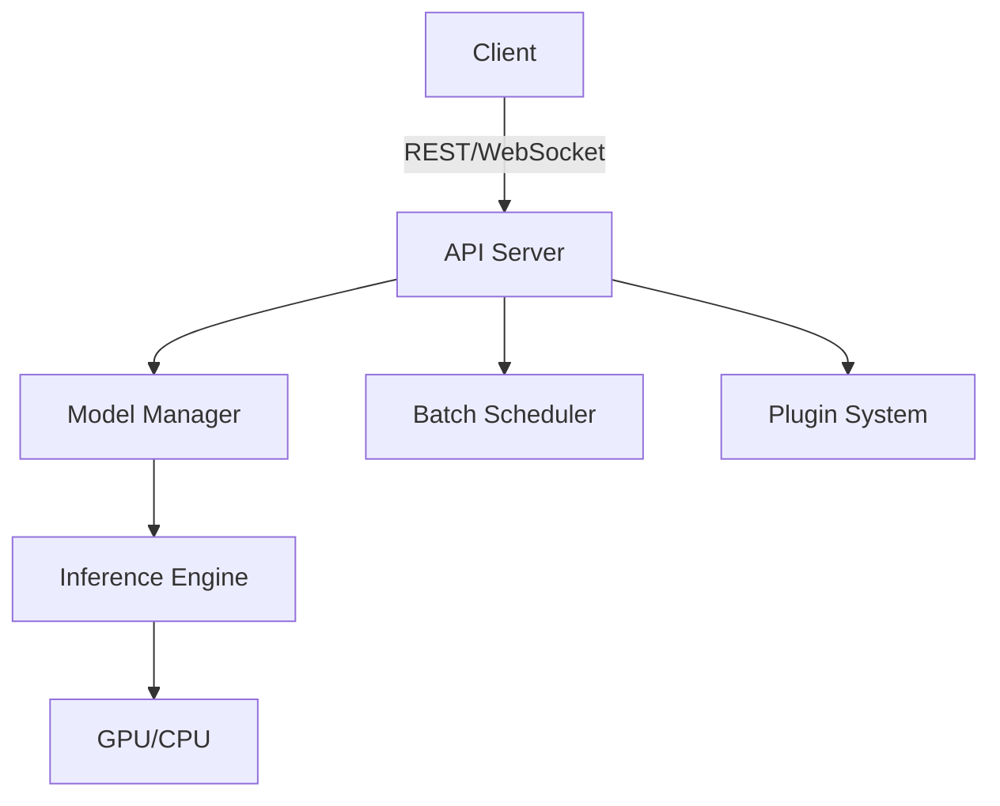

# Architecture

This page describes the architecture of Inferneo.

## Overview

Inferneo is designed for high-performance, scalable inference serving. It consists of the following main components:

- **API Server**: Handles REST and WebSocket requests
- **Model Manager**: Loads and manages models
- **Inference Engine**: Executes model inference (CPU/GPU)
- **Batch Scheduler**: Groups and schedules requests for batching
- **Plugin System**: Supports custom extensions

## Component Diagram

## Request Flow

1. **Client** sends a request (REST or WebSocket)
2. **API Server** receives and validates the request
3. **Model Manager** loads the requested model (if not already loaded)
4. **Batch Scheduler** groups requests for efficient processing
5. **Inference Engine** runs the model on the appropriate hardware
6. **API Server** returns the response to the client

## Scalability
- Multi-GPU and multi-node support
- Horizontal scaling with load balancers

## Extensibility
- Plugin system for custom pre/post-processing, logging, and monitoring

## Next Steps
- **[Performance Tuning](performance-tuning.md)**
- **[Custom Models](custom-models.md)** 